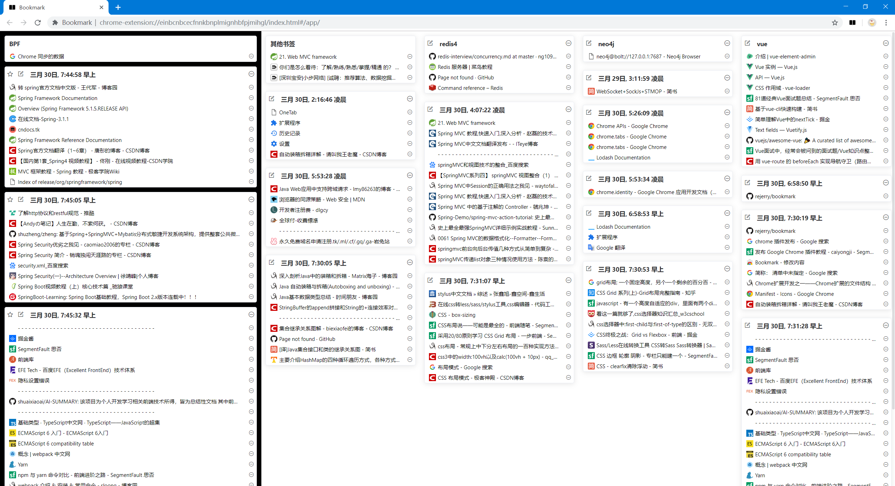

  

<h1 align="center">onetab2</h1>

[中文README](README.md)

Process bookmarks for Chrome\"Other Folders\". There are storage \"temporary\" bookmarks, classified save bookmarks, shortcut key operations, custom settings, quick view bookmarks, efficient management of bookmarks and more.

### Features

##### 主页（展示）

[Send us a feature request.](https://github.com/rejerry/onetab2/issues/new)

### Tutorial

##### Homepage (Display List)

- The plugin displays bookmarks for "Other Folders" in the chrome bookmarks bar
- Body: 1 (left, black background) displays bookmarks in the "BPF" folder, scrolling in a single column; 2 (right) displays all bookmarks except the first BPF folder, using waterfall layout
- Design: 1 Left - Used to store "temporary" bookmarks, analog to onetab (if you don't know, please search); this part of the bookmark is used to store temporary bookmarks, but the bookmarks are synced to your google account. 2 right - you can save "temporary" bookmarks here

##### Operation

- hot key
- Settings
- Right click menu
- Click icon default action
- icon right click menu

##### 7 operations

- Display list
- Save the label on the left
- Save the label on the right
- Save selected tags
- Store unchecked labels
- Store all tags
- Store all tags for all windows

##### noted

- please keep only one folder called "BPF" and put it under the first layer of "other folders";

- empty folders are not displayed by default

### Installation

[Bookmark - Chrome 网上应用店](https://chrome.google.com/webstore/detail/bookmark/paigdnkkmodopofccgdeacgoocgeijkn/related?hl=zh-CN&gl=US)

### Development

Build your own from following steps：
0. Clone this repo
0. Install dependencies (use `yarn` command)
0. Auto reload (use `yarn dev` command)
0. Click LOAD UNPACKED button and select ./dist path
0. Build (use `yarn build` command)

### License

GPL3.0

### About the author

jerry · [rejerry(github)](https://github.com/rejerry)

### The last

Thank you for watching; Welcome to install and use, discuss bug, discuss function 3 linked.Feel free to comment below

Thanks  [cnwangjie/better-onetab: A better OneTab for Chrome & Firefox](https://github.com/cnwangjie/better-onetab)